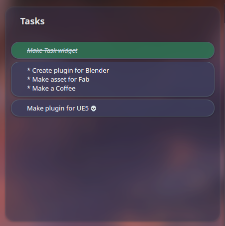
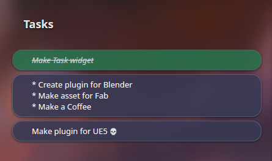
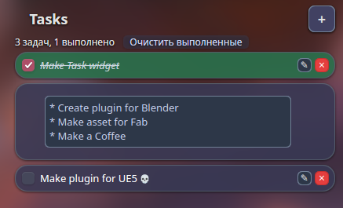

<video controls autoplay loop src="https://github.com/user-attachments/assets/0b29ac46-d75f-418e-a9a4-e08aabcf0d57"></video>
# Tasks Widget

A KDE Plasma task management widget that allows you to track and complete your daily tasks directly from your desktop

## Features

- **Task Management**: Create, edit, and complete tasks with a simple click
- **Persistent Storage**: Tasks are saved automatically and persist across sessions
- **Customizable Appearance**: 
  - Change widget and task colors
  - Adjust opacity and blur effects
  - Customize corner and task radii
  - Set task height
- **Visual Feedback**: 
  - Completed tasks are highlighted with a different color
  - Smooth animations and transitions
- **Configurable Interface**: 
  - Hide/show background
  - Center widget title
  - Custom widget title
- **Hide Widget** (optional, off by default): Toggle the whole widget invisible. While hidden it reappears on hover so you can toggle it back
- **Blur Effects**: Optional background blur for better focus

## Screenshots

## Download

release/taskwidget-1.0.0.plasmoid

### Instalation

1. Open **System Settings**
2. Navigate to **Plasma** → **Add Plasma Applets**
3. Install plugin from file
4. Drag the widget to your panel or desktop

### Manual Installation

1. Copy this plasmoid folder to `~/.local/share/plasma/plasmoids/org.kde.plasma.taskwidget`
2. Log out and log back in (or restart Plasma)
3. Add the widget from **System Settings** → **Plasma** → **Add Plasma Applets**

## Configuration

Right-click on the widget and select **Configure Widget** to customize:

- **General Settings**:
  - Hide background
  - Center title
  - Show hide widget button
  - Widget title
  - Widget and task colors
  - Opacity settings
  - Blur effects
  - Corner and task radii
  - Task height

## Usage

1. **Add a Task**: Click the `+` button to create a new task
2. **Complete a Task**: Click on a task to mark it as completed
3. **Edit a Task**: Right-click on a task to edit or delete it
4. **Clear Completed Tasks**: Right-click on the widget to clear all completed tasks
5. **Hide the Widget**: Enable **Show hide widget button** in the settings first. An eye button then appears next to `+`. Click it to make the widget invisible; hover over its area to bring it back temporarily, then click the eye again to keep it visible

## Contributing

Contributions are welcome! Please feel free to submit pull requests or open issues for bugs and feature requests.

## License

Licensed under GPL-3.0+.

See [LICENSE](LICENSE).

## Support

For issues and questions, please open an issue.
